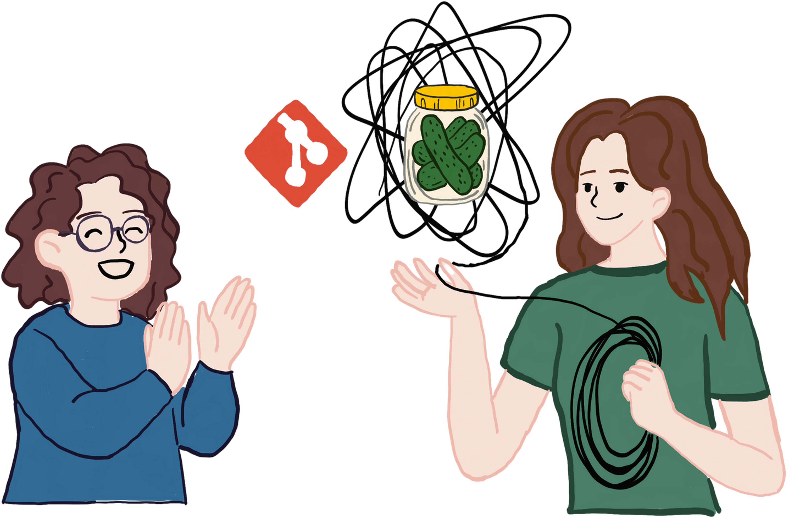
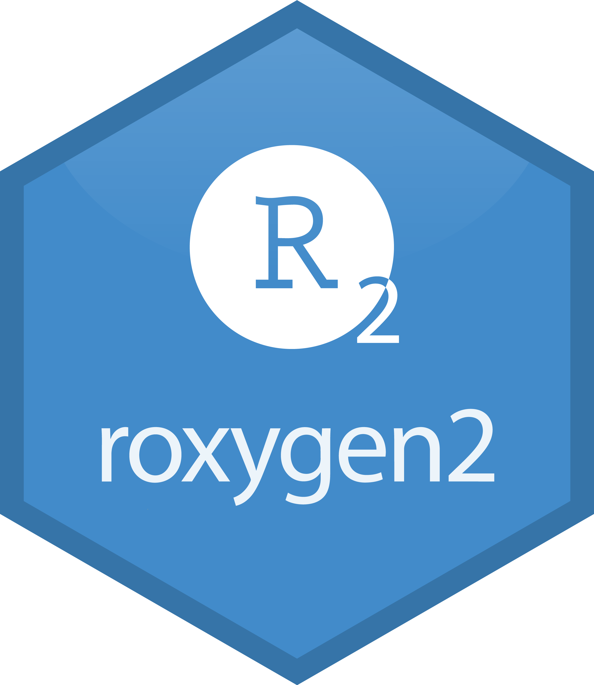

# Welcome 👋

🕓16:00 - 18:00 GMT 

🧑‍💻 Code along on [your laptop](https://statsrhian.github.io/build-r-pkg/set-up) or [Posit Cloud](https://posit.cloud/spaces/741339/)

💬 Tell me: Have you built a 📦? Why not?

## About me

:::: {.columns}
::: {.column}

🧮 NHS Data Scientist

🗣️ Stats communicator

👩‍💻 #RStats educator

💜 Community champion

🔗 rhian.rbind.io

:::
::: {.column}
{fig-alt="One woman is untangling a big mess of string around a jar of pickles, another woman is smiling and clapping."}
:::
::::

🚣‍♀️ 🚴‍♀️🧗‍♀️ 🏊‍♀️🏃‍♀️🚐🎼 🥁 🧶🏳️‍🌈 she/her


## About you 💬

- Have you ever tried to build an R package? 
- If not - why not?

# What is an R package? 

## A tool kit 🧰

{fig-alt="A toolbox with the lid locked in the closed position."}

- Not just any box of random tools
- A kit that someone else should be able to pick up and use immediately without calling you for help.

## R packages make it easier to 📦

- run code
- reuse across projects
- share with others
- manage dependencies and versions
- write nice documentation
- add tests

## Myths

It doesn't have to...

::: {.incremental}
- have hundreds of functions
- be useful for anyone else
- do anything fancy
- be on CRAN
- be scary

:::

:::{.notes}
- Small packages are fine!
- Build on the work of others
- Package warnings are okay!
:::

## ⚠️ Warning

{fig-alt="Gif from Bruce Almighty film. Jim Carry points with his fingers and a water hydrant explodes. Caption 'I've got the power'"}

Building R packages can feel empowering and can be addictive.


# What's inside an R package?

## What's in your toolbox?

:::: {.columns}
::: {.column}
```{=html}
<pre>
biketools/
</pre>
```
:::
::: {.column}
{fig-alt="A toolbox with the lid locked in the closed position."}
:::
::::

:::{.notes}
It’s not just any box of random tools, it’s a kit that someone else should be able to pick up and use immediately without calling you for instructions.
:::


## `DESCRIPTION`

:::: {.columns}
::: {.column}
```{=html}
<pre>
biketools/
├─ <span class="highlight">DESCRIPTION</span>
</pre>
```
:::
::: {.column}
{fig-alt="The lid of a toolbox with a label on it, describing that the box contains bike tools. The label also says who the toolbox belongs to and featues a version number."}
:::
::::

:::{.notes}

It lists the brand name (package name), who built it (author), what it’s for (description), model/version number, and what other kits it needs to work with (dependencies).

Without this, no one knows what kind of work the toolbox is meant for, is it for bikes, plumbing, or electronics?
:::

## `R/` folder

:::: {.columns}
::: {.column}
```{=html}
<pre>
biketools/
├─ DESCRIPTION
├─ <span class="highlight">R/
│  ├─ chain-braker.R
│  ├─ multitool.R
│  ├─ pedal-wrench.R
│  ├─ tyre-levers.R</span>
</pre>
```
:::
::: {.column}
{fig-alt="The toolbox with the lid open to reveal a collection of 4 different bicycle maintenance tools sitting on a tray."}
:::
::::

:::{.notes}
This is where the actual tools (functions) live.

Each tool has a job, each function solves a specific problem.

The better organised and labelled they are, the faster someone can find what they need.
:::


## `man/` folder

:::: {.columns}
::: {.column}
```{=html}
<pre>
biketools/
├─ DESCRIPTION
├─ R/
│  ├─ chain-braker.R
│  ├─ multitool.R
│  ├─ pedal-wrench.R
│  ├─ tyre-levers.R
├─ <span class="highlight">man/
│  ├─ chain-braker.Rd
│  ├─ multitool.Rd
│  ├─ pedal-wrench.Rd
│  ├─ tyre-levers.Rd</span>
</pre>
```
:::
::: {.column}
{fig-alt="An open toolbox with a yellow label stuck to each bicycle maintenance tool that is on the tray. Each label gives the name of that tool and a description of how to use the tool."}
:::
::::

:::{.notes}
These tell you what the tool does, how to hold it, and give examples of using it safely.
:::


## `NAMESPACE`

:::: {.columns}
::: {.column}
```{=html}
<pre>
biketools/
├─ DESCRIPTION
├─ R/
│  ├─ chain-braker.R
│  ├─ multitool.R
│  ├─ pedal-wrench.R
│  ├─ tyre-levers.R
├─ man/
│  ├─ chain-braker.Rd
│  ├─ multitool.Rd
│  ├─ pedal-wrench.Rd
│  ├─ tyre-levers.Rd
├─ <span class="highlight">NAMESPACE</span>
</pre>
```
:::
::: {.column}
{fig-alt="The open toolbox shows a tray of 4 tools at the top, with a single label stating the names of the 4 tools you can use. The label also advises that you might need to borrow gloves from Sally and another wrench from Jack. The tray sits at an angle allowing a glimpse at a collection of tools hiding at the bottom of the toolbox."}
:::
::::

:::{.notes}


- Some tools are kept in plain sight for anyone to grab (exported functions).

- Others are hidden in a secret compartment only you know about (internal functions).

- Sometimes your toolbox doesn’t have everything — you borrow tools from your friends’ toolboxes (imports).

:::

## Extra bits

:::: {.columns}
::: {.column}
```{=html}
<pre>
biketools/
├─ DESCRIPTION
├─ R/
│  ├─ chain-braker.R
│  ├─ multitool.R
│  ├─ pedal-wrench.R
│  ├─ tyre-levers.R
├─ man/
│  ├─ chain-braker.Rd
│  ├─ multitool.Rd
│  ├─ pedal-wrench.Rd
│  ├─ tyre-levers.Rd
├─ NAMESPACE
├─ <span class="highlight">data/
├─ pkgdown/
├─ tests/
├─ vignettes/
├─ README.md
├─ NEWS.md</span>
</pre>
```
:::

::: {.column}
{fig-alt="The closed toolbox has a label on the side stating the toolbox has been checked and providing a longer description of what to use the toolbox for. Behind the toolbox is a spare tyre and an illustrated book of bicycle maintenance."}
:::
::::

:::{.notes}

- Do my tools work correctly?
- How to do a basic bike service
- Spare bit of chain for trying chain breaker
- Glossy website
- Cool paint job

:::

# Let's build 🛠️

## 👀 Demo: Create an R package

- Check we’re not in a project
- Initialise the package
- Look at the `DESCRIPTION` file
- What’s a license?
- Install the package

:::{.notes}

What makes a good package name?

:::

## 👩‍💻 Exercise 1

- Run `usethis::create_package("sums")`{.r}^[If you're using Posit Cloud - skip this step!] 
- Edit the `DESCRIPTION` file
- Run `usethis::use_mit_license()`{.r}
- Run `devtools::install()`{.r}



# 🛠️ Adding functions

## What’s a function?

:::: {.columns}
::: {.column}
- Has a name
- Takes some inputs
- Does something
- Returns something
:::
::: {.column}
```r
 add <- function(x, y) {
  x + y
}
```
:::
::::

## 👀 Demo: Add a function

- add the `add()` function to the package in `R/`^[We can't use subfolders, but we can put multiple functions in one script]
- re-install the package
- does it work?

:::{.notes}

Need to introduce adding functions without getting hung up on 
`#' @export`{.r} and `NAMESPACE`

Could manually edit it FIRST `export(hello)`{.r} and then show later how it's generated

:::

## `install` vs `load_all()`

`install()`

 - installs your package to your R library 
 - to install "ready" packages

`load_all()`

 - loads all functions and data into your environment
 - good for fast developing

## 👀 Demo: Load all

- Check environment is empty
- Run `devtools::load_all()`
- Does `add.R` work now?

## 👩‍💻 Exercise 2

- Copy the `add()`{.r} function in `R/add.R`

    ```r
    add <- function(x, y) {
      x + y
    }
    ```

- Run `devtools::load_all()`{.r}

- Try out your function `add(3, 4)`{.r}



# Adding documentation 📄

## Lending out your tools
 
:::: {.columns}
::: {.column}

- We need to _export_ our function
- Explicitly saying "you can use this"

:::
::: {.column}
{fig-alt="Hexsticker for roxygen2. it has the RStudio logo with a 2 in it."}
:::
::::


## 👀 Demo: Export your function 

- Add `#' @export` tag
- Re-install and check it works
- Inspect the `NAMESPACE`

## Help files

- What happens when you run `?dplyr::slice_head`?

## Common roxygen tags

- `@export`: exports the function
- `@param`: what does an argument do? what are the defaults?
- `@returns`: what type of object does the function return?
- `@examples`: show the function in action#

## 👀 Demo: Document your function 

- Add roxygen tags
- Run `devtools::document()`
- View help files

:::{.notes}

```r
#' Add together two numbers
#' 
#' @param x A number.
#' @param y A number.
#' @returns A numeric vector.
#' @examples
#' add(1, 1)
#' add(10, 1)
#' @export
add <- function(x, y) {
  x + y
}
```

:::

## 👩‍💻 Exercise 3

1. Add some {roxygen2} strings

    ```r
    #' Add together two numbers
    #' 
    #' @param x A number.
    #' @param y A number.
    #' @returns A numeric vector.
    #' @examples
    #' add(1, 1)
    #' add(10, 1)
    #' @export
    add <- function(x, y) {
      x + y
    }
    ```

1. Run `devtools::document()`{.r}; `devtools::load_all()`{.r}

1. View the help file `?add`{.r}




# Checking your package ✅

## Inspect your toolbox

- Do all the tools work?
- Does they have instruction manuals?
- Is there anything in there that shouldn't be in there?
- Is it too heavy?

`1 error ✖ | 1 warning ✖ | 2 notes ✖`

:::{.notes}

An inspection before lending the box, ensures all tools are there and safe.

If something fails inspection, you get a report telling you exactly what to fix.

:::


## 👀 Demo: Package check

- Run `devtools::check()` 
- Inspect the output

## 👩‍💻 Exercise 4

1. Run `devtools::check()`{.r}

Don't worry if it doesn't all pass!



## 👀 Demo: Borrowing other functions


- Add `cli_alert_success("You added two numbers")`{.r} to `add()`{.r}

- Run **check**

- Prefix with `cli::`{.r}

- Run **check**

- Use `usethis::use_package("cli")`{.r} to update `Imports:`

- Run **check**

## 👩‍💻 Exercise 5

1. Add `cli::cli_alert_success("You added two numbers")`{.r} to `add()`{.r}

1. Run **check**

1. Use `usethis::use_package("cli")`{.r} to update `Imports:`

1. Run **check**




# You did it! 🥳

## Share your package 🔁


- Local install: `devtools::install_local("biketools.zip")`{.r}

- GitHub: `devtools::install_github("statsrhian/biketools")`{.r}

- CRAN: `install.packages("biketools")`{.r}


# Bonus stuff 🎁

## Use {usethis}

:::: {.columns}
::: {.column}

- `use_readme_md()`{.r}

- `use_data()`{.r}

- `use_testthat()`{.r}

- `use_vignettes()`{.r}

- `use_pkgdown()`{.r}

- `use_news_md()`{.r}

- `use_github_actions()`{.r}

:::
::: {.column}

](img/usethis-cartoon.png){fig-alt="Cartoon of two fluffy creatures going up a hill. One (called usethis) is giving the other one (called me) a piggyback."}
:::
:::: 


<!---
## Developer process 🔄

::::{.columns}

:::{.column}
### Editing code

1. Make code changes
1. `devtools::load_all()`{.r}

### Add new function

1. Create  and `@export`{.r}
1. `devtools::document()`{.r}
1. `devtools::load_all()`{.r}

:::

:::{.column}

### Editing docs

1. Edit function docs
1. `devtools::document()`{.r}

### All changes ready

1. `devtools::check()`{.r}
1. `devtools::install()`{.r}
1. Publish code

:::
::::
--->

## Go forth and build! 👷‍♀️

:::: {.columns}
::: {.column}

- Remember to make a [hex sticker](https://connect.thinkr.fr/hexmake/)

- Let me know how you get on 📧 @statsRhian
:::

::: {.column}
{fig-alt="Example hex sticker showing the rainbowR background hex" fig-align="right" width=80%}
:::
:::: 

