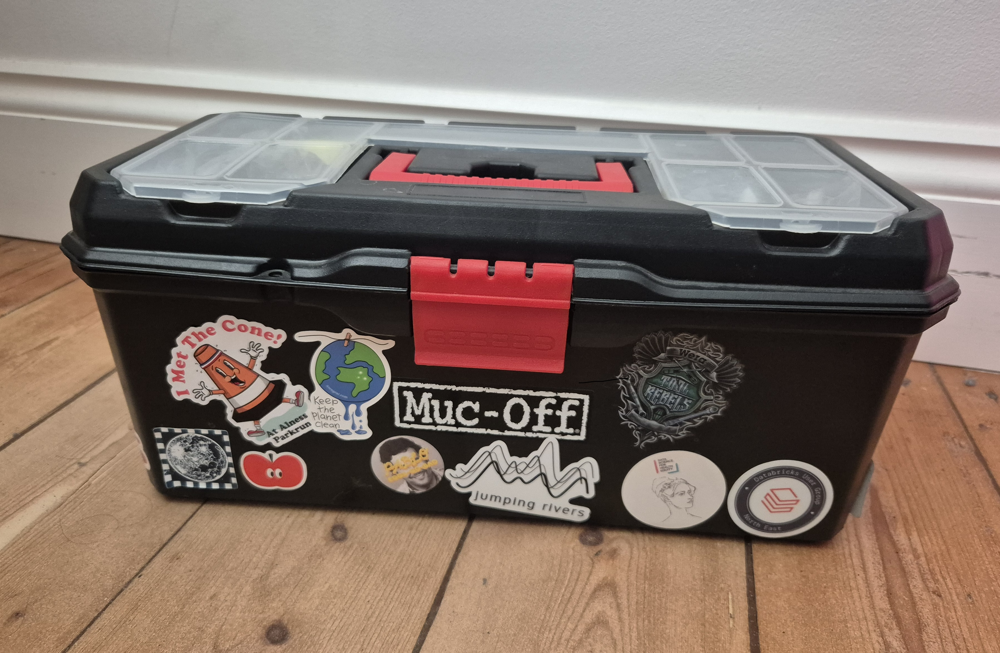
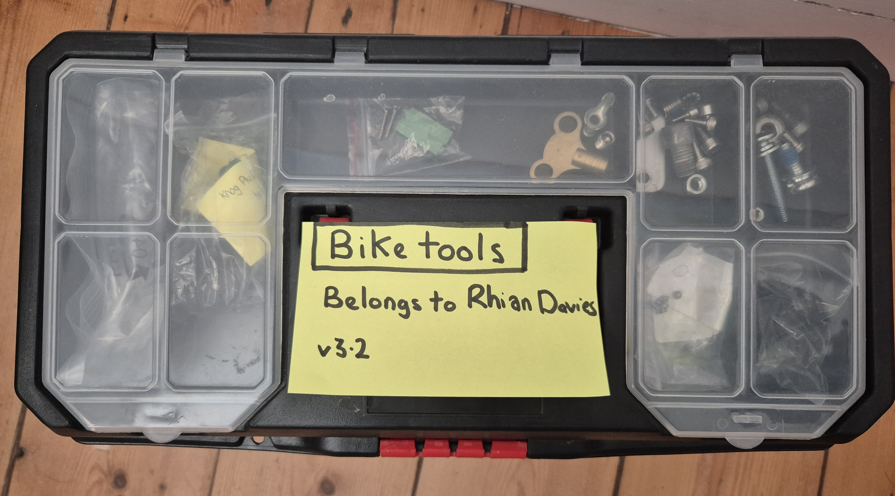
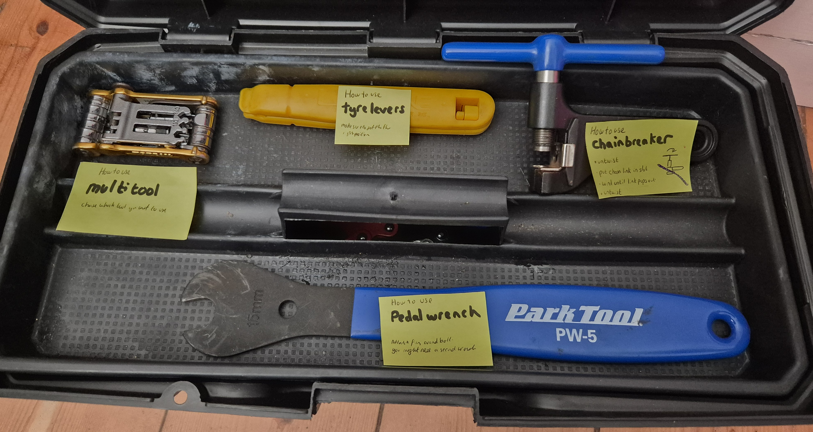
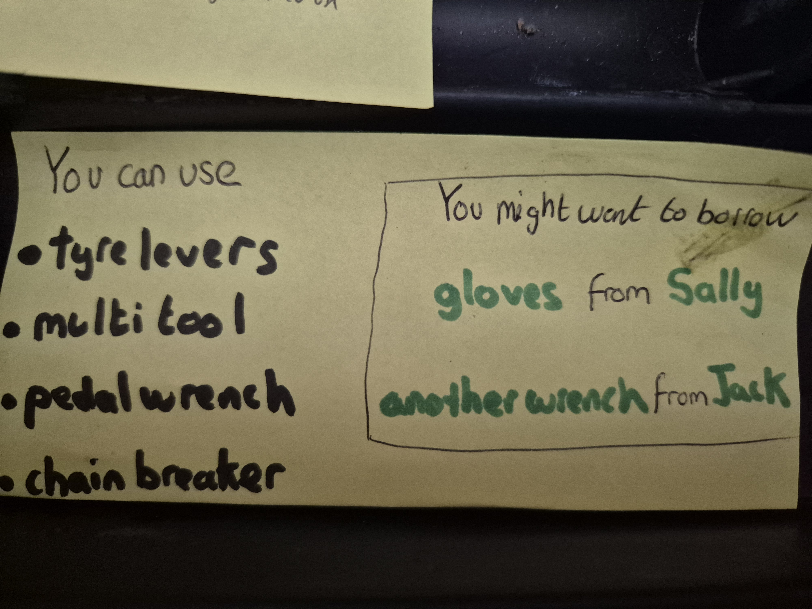
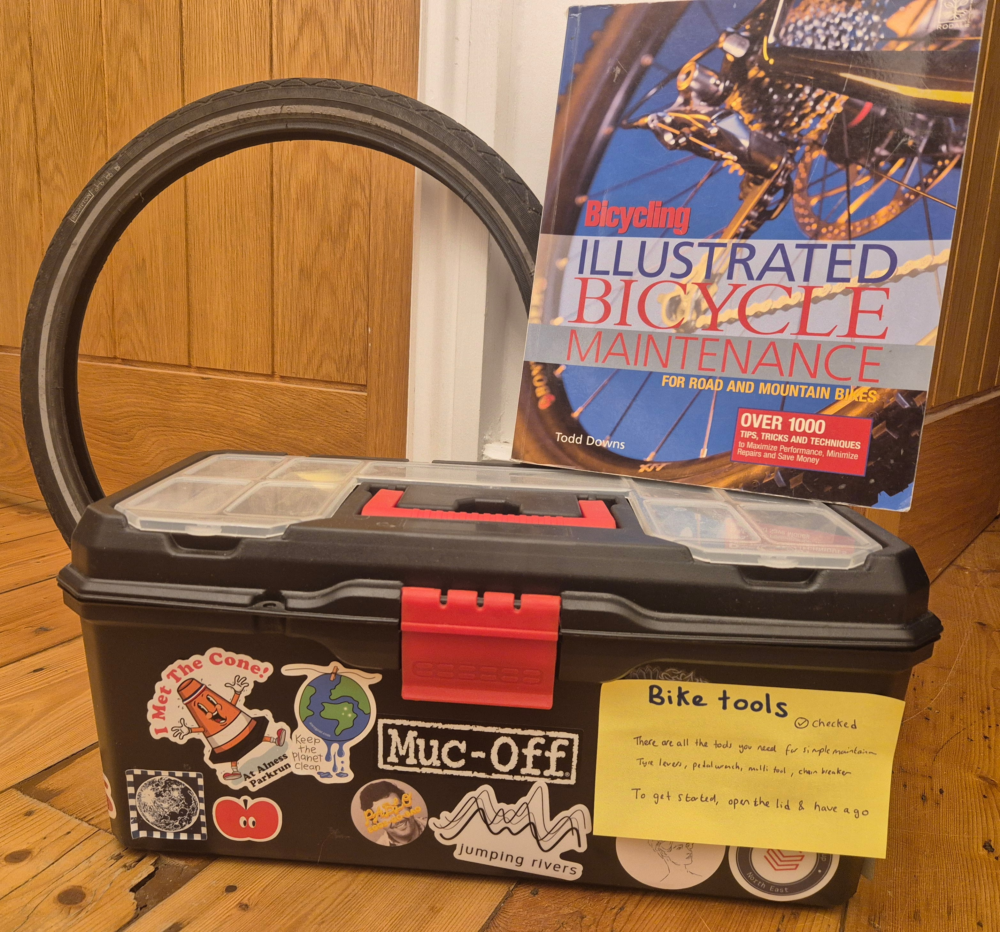

## Set-up 👩‍💻

- Welcome! We'll start the workshop shortly

- If you want to code along with me, please follow the set-up instructions ⬇️

### [statsrhian.github.io/build-r-pkg/set-up](https://statsrhian.github.io/build-r-pkg/set-up)

- If you'd prefer to just want to sit back and watch, that's fine too 😊

- WiFi: RSS `edin2025`

# Welcome

<!--- TO FIX

“What’s one function you’d put in your personal package?”

- Rewrite "developer slide"
- should I mention devtools::load_all()
- tidy notes
- add next steps to last slide (resources)
--->

## What is an R package?

{fig-alt="A toolbox with the lid locked in the closed position."}

## Why build one?

- Reproducible
- Reusability across projects
- Testing is easier
- Dependency management
- Easy to use documentation
- It's fun and empowering
- Sharing is caring

## Myths

It doesn't have to...

::: {.incremental}
- have hundreds of functions
- be useful for anyone else
- do anything fancy
- be on CRAN
- be scary

:::

:::{.notes}
- Small packages are fine!
- Build on the work of others
- Package warnings are okay!
:::

# Your personal toolbox

It’s not just any box of random tools — it’s a kit that someone else should be able to pick up and use immediately without calling you for instructions.

## What's in your toolbox?

:::: {.columns}
::: {.column}
```{=html}
<pre>
biketools/
</pre>
```
:::
::: {.column}
{fig-alt="A toolbox with the lid locked in the closed position."}
:::
::::

:::{.notes}
It’s not just any box of random tools, it’s a kit that someone else should be able to pick up and use immediately without calling you for instructions.
:::


## `DESCRIPTION`

:::: {.columns}
::: {.column}
```{=html}
<pre>
biketools/
├─ <span class="highlight">DESCRIPTION</span>
</pre>
```
:::
::: {.column}
{fig-alt="The lid of a toolbox with a label on it, describing that the box contains bike tools. The label also says who the toolbox belongs to and featues a version number."}
:::
::::

:::{.notes}

It lists the brand name (package name), who built it (author), what it’s for (description), model/version number, and what other kits it needs to work with (dependencies).

Without this, no one knows what kind of work the toolbox is meant for, is it for bikes, plumbing, or electronics?
:::

## `R/` folder

:::: {.columns}
::: {.column}
```{=html}
<pre>
biketools/
├─ DESCRIPTION
├─ <span class="highlight">R/
│  ├─ chain-braker.R
│  ├─ multitool.R
│  ├─ pedal-wrench.R
│  ├─ tyre-levers.R</span>
</pre>
```
:::
::: {.column}
{fig-alt="The toolbox with the lid open to reveal a collection of 4 different bicycle maintenance tools sitting on a tray."}
:::
::::

:::{.notes}
This is where the actual tools (functions) live.

Each tool has a job, each function solves a specific problem.

The better organised and labelled they are, the faster someone can find what they need.
:::


## `man/` folder

:::: {.columns}
::: {.column}
```{=html}
<pre>
biketools/
├─ DESCRIPTION
├─ R/
│  ├─ chain-braker.R
│  ├─ multitool.R
│  ├─ pedal-wrench.R
│  ├─ tyre-levers.R
├─ <span class="highlight">man/
│  ├─ chain-braker.Rd
│  ├─ multitool.Rd
│  ├─ pedal-wrench.Rd
│  ├─ tyre-levers.Rd</span>
</pre>
```
:::
::: {.column}
{fig-alt="An open toolbox with a yellow label stuck to each bicycle maintenance tool that is on the tray. Each label gives the name of that tool and a description of how to use the tool."}
:::
::::

:::{.notes}
These tell you what the tool does, how to hold it, and give examples of using it safely.
:::


## `NAMESPACE`

:::: {.columns}
::: {.column}
```{=html}
<pre>
biketools/
├─ DESCRIPTION
├─ R/
│  ├─ chain-braker.R
│  ├─ multitool.R
│  ├─ pedal-wrench.R
│  ├─ tyre-levers.R
├─ man/
│  ├─ chain-braker.Rd
│  ├─ multitool.Rd
│  ├─ pedal-wrench.Rd
│  ├─ tyre-levers.Rd
├─ <span class="highlight">NAMESPACE</span>
</pre>
```
:::
::: {.column}
{fig-alt="The open toolbox shows a tray of 4 tools at the top, with a single label stating the names of the 4 tools you can use. The label also advises that you might need to borrow gloves from Sally and another wrench from Jack. The tray sits at an angle allowing a glimpse at a collection of tools hiding at the bottom of the toolbox."}
:::
::::

:::{.notes}


- Some tools are kept in plain sight for anyone to grab (exported functions).

- Others are hidden in a secret compartment only you know about (internal functions).

- Sometimes your toolbox doesn’t have everything — you borrow tools from your friends’ toolboxes (imports).

:::

## Extra bits

:::: {.columns}
::: {.column}
```{=html}
<pre>
biketools/
├─ DESCRIPTION
├─ R/
│  ├─ chain-braker.R
│  ├─ multitool.R
│  ├─ pedal-wrench.R
│  ├─ tyre-levers.R
├─ man/
│  ├─ chain-braker.Rd
│  ├─ multitool.Rd
│  ├─ pedal-wrench.Rd
│  ├─ tyre-levers.Rd
├─ NAMESPACE
├─ <span class="highlight">data/
├─ pkgdown/
├─ tests/
├─ vignettes/
├─ README.md
├─ NEWS.md</span>
</pre>
```
:::

::: {.column}
{fig-alt="The closed toolbox has a label on the side stating the toolbox has been checked and providing a longer description of what to use the toolbox for. Behind the toolbox is a spare tyre and an illustrated book of bicycle maintenance."}
:::
::::

:::{.notes}

- Do my tools work correctly?
- How to do a basic bike service
- Spare bit of chain for trying chain breaker
- Glossy website
- Cool paint job

:::

# Let's build 🛠️

## 👀 Create an R package

## 👩‍💻 Create an R package

- Run `usethis::create_package("sums")`{.r}
- Open the `DESCRIPTION` file and customise it
- Run `usethis::use_mit_license()`{.r}
- Run `devtools::install()`{.r}

## 👀 Add a function

:::{.notes}

Need to introduce adding functions without getting hung up on 
`#' @export`{.r} and `NAMESPACE`

Could manually edit it FIRST `export(hello)`{.r} and then show later how it's generated

:::

## 👩‍💻 Add a function

- Copy the `add()`{.r} function in `R/add.R`

    ```r
    add <- function(x, y) {
      x + y
    }
    ```

- Add `export(add)`{.r} to `NAMESPACE`

- Run `devtools::install()`{.r}

- Try out your function `add(3, 4)`{.r}


## 👀 Document your function

:::{.notes}

```r
#' Add together two numbers
#' 
#' @param x A number.
#' @param y A number.
#' @returns A numeric vector.
#' @examples
#' add(1, 1)
#' add(10, 1)
#' @export
add <- function(x, y) {
  x + y
}
```

:::

## 👩‍💻 Document your function

1. Add some {roxygen2} strings

    ```r
    #' Add together two numbers
    #' 
    #' @param x A number.
    #' @param y A number.
    #' @returns A numeric vector.
    #' @examples
    #' add(1, 1)
    #' add(10, 1)
    #' @export
    add <- function(x, y) {
      x + y
    }
    ```

1. Run `devtools::document()`{.r}; `devtools::install()`{.r}

1. View the help file `?add`{.r}


## Package check

Inspect your toolbox before lending it out

- Do all the tools work?
- Does they have instruction manuals?
- Is there anything in there that shouldn't be in there?
- Is it too heavy?


:::{.notes}

An inspection before lending the box, ensures all tools are there and safe.

If something fails inspection, you get a report telling you exactly what to fix.

:::

## 👀 Package check

## 👩‍💻 Package check

1. Run `devtools::check()`{.r}

Don't worry if it doesn't all pass!


## 👀 Using other functions

## 👩‍💻 Using other functions

1. Add `cli_success("You added two numbers")`{.r} to `add()`{.r}

1. Run **check**

1. Prefix with `cli::`{.r}

1. Run **check**

1. Use `usethis::use_package("cli")`{.r} to update `Imports:`

1. Run **check**

## Usethis


:::: {.columns}
::: {.column}

- `use_readme_md()`{.r}

- `use_roxygen_md()`{.r}

- `use_news_md()`{.r}

- `use_github_actions()`{.r}

:::
::: {.column}

- `use_data()`{.r}

- `use_testthat()`{.r}

- `use_vignettes()`{.r}

- `use_pkgdown()`{.r}

:::
:::: 

## Developer process 🔄


::::{.columns}

:::{.column}
### Editing code

1. Make code changes
1. `devtools::load_all()`{.r}

### Add new function

1. Create  and `@export`{.r}
1. `devtools::document()`{.r}
1. `devtools::load_all()`{.r}

:::

:::{.column}

### Editing docs

1. Edit function docs
1. `devtools::document()`{.r}

### All changes ready

1. `devtools::check()`{.r}
1. `devtools::install()`{.r}
1. Publish code

:::
::::


## Share your package

::: {.incremental}

- Local install: `devtools::install_local("biketools")`{.r}

- GitHub: `devtools::install_github("statsrhian/biketools")`{.r}

- CRAN: `install.packages("biketools.zip")`{.r}

:::

## Go forth and build! 👷‍♀️

:::: {.columns}
::: {.column}

- Remember to make a [hex sticker](https://connect.thinkr.fr/hexmake/)

- Let me know how you get on 📧 @statsRhian
:::

::: {.column}
{fig-alt="Example hex sticker showing the RSSConf2025 hashtag and and image of Edinburgh Castle" fig-align="right" width=80%}
:::
:::: 

